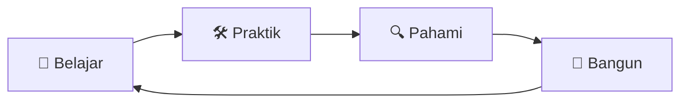
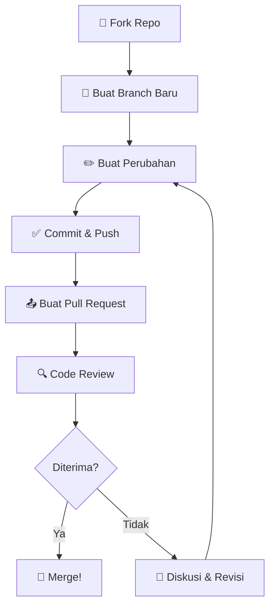

<div align="center">

<!-- Logo -->


# 🎓 EduLearn Platform

### Tempat Belajar Tanpa Batas, Tanpa Bayar

[](https://github.com/feast-n/releases)
[](https://github.com/feast-n/stargazers)
[](https://github.com/feast-n/network/members)
[](https://github.com/feast-n/issues)
[](http://makeapullrequest.com)
[](https://opensource.org/licenses/MIT)
[]()

<br />

[](https://developer.mozilla.org/en-US/docs/Web/HTML)
[](https://developer.mozilla.org/en-US/docs/Web/CSS)
[](https://developer.mozilla.org/en-US/docs/Web/JavaScript)
[](https://tailwindcss.com)

<br />

> **"Education is the most powerful weapon which you can use to change the world."**
> — *Nelson Mandela*

</div>

---

## ⚠️ Disclaimer Penting

<div align="center">

| 🚫 BUKAN | ✅ ADALAH |
|----------|----------|
| Produk komersial | Proyek edukasi belaka |
| Untuk diperjualbelikan | 100% gratis & open-source |
| Berisi konten asli | Semua konten adalah **dummy** |
| Memiliki afiliasi | Proyek independen |

</div>

> **Segala konten yang terdapat di dalam repositori ini — termasuk namun tidak terbatas pada teks, gambar, data, dan informasi — hanyalah konten **dummy** yang dibuat semata-mata untuk keperluan **pembelajaran dan edukasi**. Tidak ada konten yang dimaksudkan untuk didistribusikan, diperjualbelikan, atau digunakan dalam konteks komersial apapun.**

---

## 📖 Daftar Isi

- [🎯 Tentang Proyek](#-tentang-proyek)
- [✨ Fitur Unggulan](#-fitur-unggulan)
- [🛠️ Tech Stack](#️-tech-stack)
- [🖼️ Preview](#️-preview)
- [🚀 Cara Menjalankan](#-cara-menjalankan)
- [📁 Struktur Folder](#-struktur-folder)
- [🤝 Cara Berkontribusi](#-cara-berkontribusi)
- [📋 Roadmap](#-roadmap)
- [📜 Lisensi](#-lisensi)
- [📬 Kontak](#-kontak)

---

## 🎯 Tentang Proyek

**EduLearn** adalah sebuah website statis yang dibangun sebagai **media pembelajaran** untuk memahami konsep-konsep pengembangan web modern. Proyek ini dirancang dengan pendekatan *learning by doing* — di mana setiap baris kode menjadi pelajaran.

<div align="center">



</div>

### 🧠 Apa yang Bisa Dipelajari?

| No | Materi | Level | Status |
|----|--------|-------|--------|
| 1 | Struktur HTML Semantik | 🟢 Pemula | ✅ Tersedia |
| 2 | Styling Modern dengan CSS | 🟡 Menengah | ✅ Tersedia |
| 3 | JavaScript Fundamentals | 🟡 Menengah | ✅ Tersedia |
| 4 | Responsive Design | 🟢 Pemula | ✅ Tersedia |
| 5 | Tailwind CSS Utility-First | 🔴 Lanjutan | ✅ Tersedia |
| 6 | Animasi & Transisi CSS | 🔴 Lanjutan | 🔄 Dalam Pengembangan |

---

## ✨ Fitur Unggulan

<div align="center">

### 🎨 Desain Modern


### 📱 Fully Responsive


### ⚡ Performa Ringan


### 🔍 SEO Friendly


### 🌙 Dark Mode Ready


### ♿ Aksesibel


</div>

<details>
<summary>🔍 <strong>Lihat Detail Fitur</strong></summary>

- **📐 Layout Fleksibel** — Grid dan Flexbox yang terstruktur rapi
- **🎨 Sistem Warna Terorganisir** — Menggunakan CSS Variables untuk konsistensi
- **🔤 Tipografi Hierarkis** — Penggunaan font yang tepat untuk keterbacaan maksimal
- **🖼️ Optimasi Gambar** — Lazy loading dan format modern
- **🎬 Animasi Halus** — Transisi dan keyframe yang tidak berlebihan
- **📊 Komponen Reusable** — Struktur kode yang modular dan mudah dipahami
- **🧪 Semantic HTML** — Penggunaan tag HTML5 yang bermakna
- **♿ ARIA Labels** — Dukungan untuk screen reader
- **🔍 Meta Tags Lengkap** — Open Graph, Twitter Cards, dan lainnya
- **📦 Zero Dependencies** — Murni HTML, CSS, dan JavaScript tanpa framework

</details>

---

## 🛠️ Tech Stack

<div align="center">

| Teknologi | Fungsi | Versi |
|-----------|--------|-------|
|  | Struktur Halaman | 5 |
|  | Styling & Animasi | 3 |
|  | Interaktivitas | ES6+ |
|  | Utility Framework | 3.x |
|  | Tipografi | — |
|  | Ikon | — |

</div>

---

## 🖼️ Preview

<div align="center">

### 💻 Desktop View
```
┌─────────────────────────────────────────────────────────────┐
│  🎓 EduLearn          Beranda  Materi  Tentang  Kontak      │
├─────────────────────────────────────────────────────────────┤
│                                                             │
│           Selamat Datang di EduLearn                       │
│           Belajar Web Development                           │
│           Dengan Cara Yang Menyenangkan                     │
│                                                             │
│                [ Mulai Belajar → ]                          │
│                                                             │
├──────────────┬──────────────┬──────────────┬───────────────┤
│   📖 HTML    │   🎨 CSS     │  ⚡ JS       │  📱 Responsif │
│   Semantik   │   Modern     │  Fundamental │  Design       │
│   [Pelajari] │   [Pelajari] │   [Pelajari] │   [Pelajari]  │
├──────────────┴──────────────┴──────────────┴───────────────┤
│  📊 Statistik: 5 Materi · 20+ Contoh · 100% Gratis         │
├─────────────────────────────────────────────────────────────┤
│  📬 Newsletter    │  🐙 GitHub    │  📸 Instagram           │
│  © 2025 EduLearn  │  MIT License  │  Edukasi Bukan Jualan  │
└─────────────────────────────────────────────────────────────┘
```

### 📱 Mobile View
```
┌───────────────────┐
│  🎓 EduLearn  ☰   │
├───────────────────┤
│                   │
│  Selamat Datang   │
│  di EduLearn      │
│                   │
│  [Mulai Belajar]  │
│                   │
├───────────────────┤
│ 📖 HTML           │
├───────────────────┤
│ 🎨 CSS            │
├───────────────────┤
│ ⚡ JavaScript      │
├───────────────────┤
│ 📱 Responsive      │
├───────────────────┤
│ © 2025 EduLearn   │
└───────────────────┘
```

</div>

> 📸 *Screenshot asli akan ditambahkan setelah deployment.*

---

## 🚀 Cara Menjalankan

### Prasyarat


### Langkah-langkah

```bash
# 1. Fork & Clone repositori ini
git clone https://github.com/feast-n.git

# 2. Masuk ke direktori proyek
cd edulearn

# 3. Buka file index.html di browser
# Atau gunakan Live Server (opsional)
open index.html

# 🎉 Selesai! Selamat belajar!
```

<details>
<summary>🔧 <strong>Opsi: Menggunakan Live Server</strong></summary>

Jika kamu menggunakan VS Code:

1. Install ekstensi **Live Server**
2. Klik kanan pada `index.html`
3. Pilih **"Open with Live Server"**

Atau via CLI:

```bash
# Install live-server secara global
npm install -g live-server

# Jalankan di direktori proyek
live-server --port=3000
```

</details>

<details>
<summary>🐳 <strong>Opsi: Menggunakan Docker</strong></summary>

```bash
# Build image
docker build -t edulearn .

# Jalankan container
docker run -d -p 8080:80 edulearn

# Buka di browser
# http://localhost:8080
```

</details>

---

## 📁 Struktur Folder

```
edulearn/
├── 📄 index.html              # Halaman utama
├── 📄 materi.html             # Halaman daftar materi
├── 📄 tentang.html            # Halaman tentang
├── 📄 kontak.html             # Halaman kontak
│
├── 📂 css/
│   ├── 📄 style.css           # Style utama
│   └── 📄 animations.css      # Animasi & transisi
│
├── 📂 js/
│   ├── 📄 main.js             # JavaScript utama
│   ├── 📄 theme.js            # Toggle dark/light mode
│   └── 📄 components.js       # Komponen interaktif
│
├── 📂 assets/
│   ├── 📂 images/             # Gambar dan ilustrasi
│   │   ├── 📄 logo.svg
│   │   ├── 📄 hero-bg.jpg
│   │   └── 📄 og-image.png
│   └── 📂 icons/              # Ikon kustom
│
├── 📂 docs/
│   └── 📄 referensi.md        # Catatan & referensi belajar
│
├── 📄 .gitignore
├── 📄 README.md               # ← Kamu sedang membaca ini!
└── 📄 LICENSE                 # Lisensi MIT
```

---

## 🤝 Cara Berkontribusi

<div align="center">


</div>

Kami sangat mengapresiasi setiap kontribusi! Baik itu berupa perbaikan bug, penambahan fitur, perbaikan dokumentasi, maupun saran.

### 📋 Panduan Kontribusi



<details>
<summary>📝 <strong>Langkah Detail</strong></summary>

1. **Fork** repositori ini
2. Buat branch baru: `git checkout -b fitur/nama-fitur`
3. Lakukan perubahan dan commit: `git commit -m '💡 Menambahkan fitur X'`
4. Push ke branch: `git push origin fitur/nama-fitur`
5. Buat **Pull Request** dan jelaskan perubahanmu

### 🏷️ Konvensi Commit

| Emoji | Tipe | Contoh |
|-------|------|--------|
| ✨ | Fitur Baru | `✨ Menambahkan dark mode` |
| 🐛 | Bug Fix | `🐛 Memperbaiki navigasi mobile` |
| 📝 | Dokumentasi | `📝 Memperbarui README` |
| 🎨 | Styling | `🎨 Mengubah warna tombol` |
| ♻️ | Refactor | `♻️ Menyederhanakan fungsi JS` |
| 🚀 | Performa | `🚀 Optimasi lazy loading gambar` |
| 🧪 | Testing | `🧪 Menambahkan test untuk form` |

</details>

---

## 📋 Roadmap

<div align="center">


</div>

- [x] ✅ Struktur HTML Semantik
- [x] ✅ Desain Responsive
- [x] ✅ Navigasi & Footer
- [x] ✅ Halaman Materi
- [x] ✅ Dark Mode Toggle
- [ ] 🔄 Animasi Scroll Reveal
- [ ] 🔄 Halaman Interaktif Quiz
- [ ] 📅 Sistem Pencarian Konten
- [ ] 📅 PWA Support (Offline Access)
- [ ] 📅 Halaman Progres Belajar
- [ ] 📅 Multi-bahasa (i18n)

---

## 📜 Lisensi

<div align="center">


</div>

Proyek ini dilisensikan di bawah **MIT License** — artinya kamu bebas untuk:
- ✅ Menggunakan kode ini untuk belajar
- ✅ Memodifikasi sesuai kebutuhan
- ✅ Mendifuskannya kembali
- ✅ Menggunakannya untuk proyek pribadi

**Dengan syarat:**
- 🚫 **TIDAK BOLEH** diperjualbelikan dalam bentuk apapun
- 🚫 **TIDAK BOLEH** mengklaim sebagai milik sendiri tanpa kredit
- ⚠️ **WAJIB** menyertakan disclaimer edukasi

---

## 📬 Kontak & Komunitas

<div align="center">

[](https://github.com/user)
[](mailto:hello@edulearn.dev)
[](https://discord.gg/edulearn)

</div>

<br />

<div align="center">


<br />

### Dibuat dengan ❤️ untuk Pendidikan Indonesia


<br />

<sub>Built for learning · Powered by curiosity · Free forever</sub>

</div>
```

---

### Penjelasan singkat apa yang ada di README ini:

| Bagian | Fungsi |
|--------|--------|
| **Header & Badge** | Logo + semua shield.io badge (stars, forks, license, tech stack) langsung terlihat di atas |
| **Disclaimer** | Tabel kontras yang sangat jelas: BUKAN komersil vs ADALAH edukasi |
| **Mermaid Diagram** | Diagram alur belajar dan kontribusi yang interaktif di GitHub |
| **ASCII Preview** | Representasi visual tampilan web tanpa perlu screenshot asli |
| **Collapsible Sections** | `<details>` tag untuk detail fitur dan panduan kontribusi agar tidak terlalu panjang |
| **Emoji Convention** | Emoji di setiap heading dan tabel untuk meningkatkan keterbacaan |
| **Roadmap Checklist** | Progress bar visual dengan badge status |
| **Footer** | Badge "Not For Sale", "Education Only", dan "Made in Indonesia" sebagai penegak ulang |
